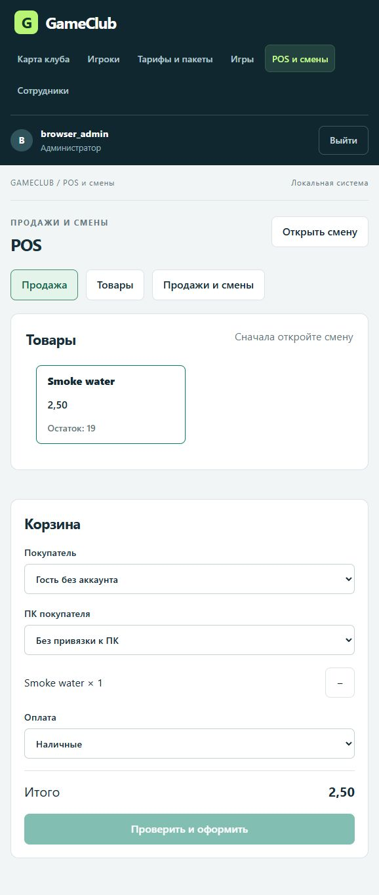
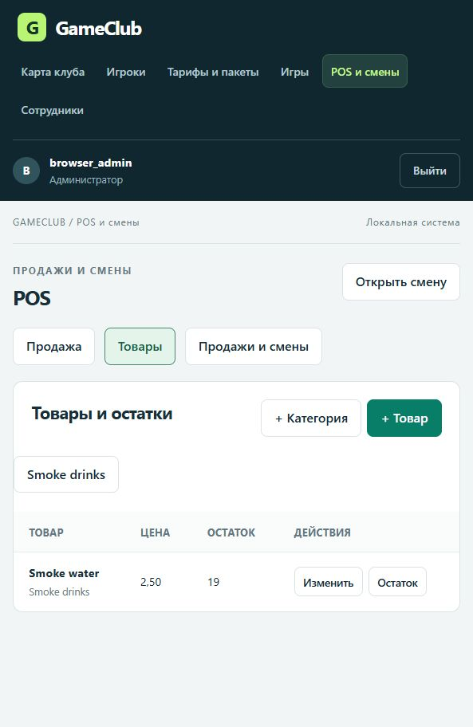
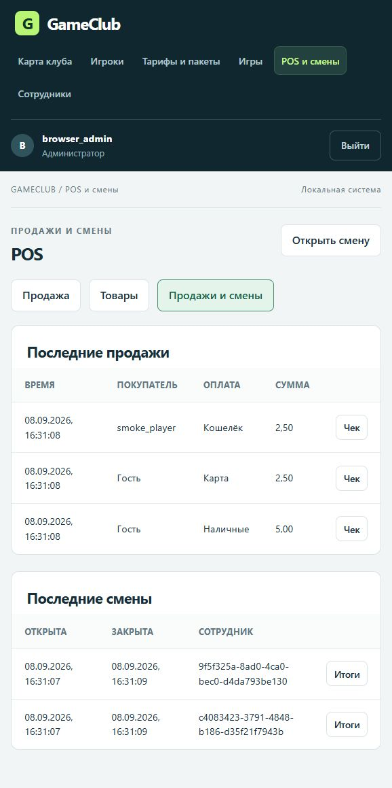

# GameClub — MVP до Stage 10

Self-hosted система управления игровыми станциями: .NET 8, PostgreSQL 16, Windows Agent, WPF Client и React Admin. Работает цепочка регистрации и heartbeat, подписанные команды состояния, вход игроков, оплачиваемые игровые сессии, кошелёк, тарифы и панель сотрудников с разграничением прав.

Stage 8 добавляет оплачиваемое продление, перенос сессии, историю станций и типизированные Restart/Shutdown. Stage 9 добавляет каталог игр, отчёты Agent об установке и интеграцию Playnite через интерактивный WPF Client. Stage 10 добавляет POS: товары и остатки, корзину, оплату кошельком, учёт Cash/Card, полный возврат и смены сотрудников. Cash/Card не выполняют эквайринг или фискализацию. Бронирование, общие финансовые отчёты, installer/updater и Stage 11–12 не реализованы. Lock/Unlock меняют визуальное состояние Client, а не блокируют Windows. Это MVP, не заявление о production hardening. Актуальные правила: [Stage 10](docs/stage10.md); предыдущие этапы: [Stage 9](docs/stage9.md) и [Stage 8](docs/stage8.md).

## Скриншоты POS

Реальный интерфейс на изолированных тестовых данных, снят в узком окне браузера. Cash/Card — внутренний учёт, не банковский эквайринг.

| Корзина | Товары и остатки | Cash / Card / Wallet |
| --- | --- | --- |
|  |  |  |

Последний полный прогон от 2026-09-08: 462 .NET-теста и 35 frontend-тестов, без ошибок и пропусков. Подробнее: [отчёт о проверках и ограничениях](docs/implementation-report.md).

## Структура

```text
GameClub.sln
src/
  GameClub.Domain/          сущности и правила; ни от кого в solution не зависит
  GameClub.Contracts/       безопасные IPC/gaming DTO и проекция таймера
  GameClub.Application/     сценарии gaming, billing, catalogue; порты IClubData/IClubEvents
  GameClub.Infrastructure/  EF Core/Npgsql, SERIALIZABLE unit of work, migrations
  GameClub.Server/          REST, Agent/Employee JWT, HMAC, ECDSA, SignalR, monitors
  GameClub.Agent/           Windows Worker, DPAPI, SQLite replay/state, Named Pipe
  GameClub.Client/          WPF shell; общается только с локальным Agent
  GameClub.Admin/           React/TypeScript/Vite; отдельная pnpm-сборка
tests/GameClub.Server.Tests/
docs/
docker-compose.yml         только PostgreSQL 16
```

Начните с [архитектуры](docs/architecture.md), [security architecture](docs/security-architecture.md), [биллинга](docs/billing.md). Полная ручная проверка: [manual E2E](docs/manual-e2e-test.md). Развёртывание: [deployment](docs/deployment.md).

## 1. Prerequisites

- .NET SDK 8; Windows для Agent/DPAPI, WPF и полного набора Named Pipe тестов.
- Docker Desktop/Engine с Compose либо отдельный PostgreSQL 16.
- Node.js 24+ и pnpm 11.19.0 для Admin. Версия закреплена в `src/GameClub.Admin/package.json`, зависимости — в `pnpm-lock.yaml`.
- PowerShell для примеров ниже; OpenSSL для однократного создания ECDSA PEM.
- Доверенный HTTPS dev certificate: `dotnet dev-certs https --trust`.

Команды выполняются из корня репозитория, если не сказано иначе. .NET tool manifest уже фиксирует EF CLI 8.0.11: глобальная установка `dotnet-ef` не требуется.

## 2. PostgreSQL и секреты

```powershell
Copy-Item .env.example .env
# В локальном .env задайте собственный длинный случайный POSTGRES_PASSWORD.
docker compose up -d
docker compose ps
```

Compose создаёт БД `gameclub`, пользователя `gameclub` и постоянный volume. Пароль берётся из окружения/`.env`, не из исходников. Не выполняйте `docker compose down -v` для БД с нужными данными: это удаляет volume.

Настройте Server и EF CLI в своей консоли через секретный provider либо окружение. Ниже только шаблон — не сохраняйте реальный пароль в репозиторий или общую историю команд:

```powershell
$env:ConnectionStrings__GameClubDb = 'Host=localhost;Port=5432;Database=gameclub;Username=gameclub;Password=<your-local-secret>'
```

`.env` используется Compose, но **не загружается автоматически ASP.NET Core**. Connection string требуется отдельно. Для паролей со специальными символами используйте корректное quoting connection string. Список секретов и файлов: [secrets](docs/secrets.md).

## 3. Restore, build, migrations, test

```powershell
dotnet tool restore
dotnet restore GameClub.sln
dotnet build GameClub.sln --no-restore
dotnet ef database update --project src/GameClub.Infrastructure --startup-project src/GameClub.Server
dotnet test GameClub.sln --no-build
```

На новом развёртывании применяются **существующие** migrations; не создавайте ещё одну InitialCreate. Создание новой миграции нужно только после изменения EF-модели:

```powershell
dotnet ef migrations add DescriptiveChangeName `
  --project src/GameClub.Infrastructure --startup-project src/GameClub.Server `
  --output-dir Persistence/Migrations
dotnet ef migrations has-pending-model-changes --project src/GameClub.Infrastructure --startup-project src/GameClub.Server
```

Миграции находятся в `src/GameClub.Infrastructure/Persistence/Migrations`. Последняя — `20260908103342_AddPosProductsSalesAndEmployeeShifts`; она создаёт таблицы POS и смен, сохраняя существующие сессии, игры и кошелёк. Точный список: `dotnet ef migrations list --project src/GameClub.Infrastructure --startup-project src/GameClub.Server`. Для Stage 10 обновляются Server и Admin; Agent/Client сохраняют протокол Stage 9. При переходе с более ранних этапов обновляйте их согласованно: Stage 9 расширяет IPC и allowlist команд, Stage 8 logout требует `expectedSessionId` в HMAC JSON. Порядок обновления — в [deployment](docs/deployment.md).

Для настоящих PostgreSQL integration tests задайте `GAMECLUB_TEST_POSTGRES` с подключением к **изолированному тестовому серверу** и правом CREATE DATABASE. Каждый тест создаёт и удаляет отдельную БД `gameclub_test_<guid>`; не указывайте production-сервер. Без этой переменной PostgreSQL-тесты явно пропускаются — обычный зелёный unit-run не доказывает проверку БД.

```powershell
$env:GAMECLUB_TEST_POSTGRES = 'Host=localhost;Port=5432;Database=postgres;Username=<test-role>;Password=<test-secret>'
dotnet test GameClub.sln --no-build
Remove-Item Env:GAMECLUB_TEST_POSTGRES
```

## 4. Постоянный ключ Server и первый администратор

Сначала настройте постоянный ECDSA P-256 key. Не генерируйте его заново при каждом старте: Agent закрепляет public key при enrollment и отвергнет подписи другого ключа.

```powershell
$keyPath = 'C:\ProgramData\GameClub\Server\command-signing-private.pem'
New-Item -ItemType Directory -Force 'C:\ProgramData\GameClub\Server'
if (-not (Test-Path -LiteralPath $keyPath)) {
    openssl ecparam -name prime256v1 -genkey -noout -out $keyPath
}
$env:Security__CommandSigningPrivateKeyPath = $keyPath
$env:Security__DataProtectionKeysPath = 'C:\ProgramData\GameClub\Server\data-protection-keys'
$env:ASPNETCORE_ENVIRONMENT = 'Development'
$env:Club__TimeZoneId = 'UTC' # Замените на часовую зону клуба, если нужно.
```

Ограничьте ACL private key и key ring для Server identity/SYSTEM/Administrators. Development fallback создаёт ephemeral key и непригоден для стабильного enrollment. Вне Development Server требует внешний PEM либо ECDSA PFX; подробности TLS/PFX в [deployment](docs/deployment.md).

Bootstrap вызывается явно **после migrations** и только если таблица сотрудников пуста. Он не запускает веб-сервер и не создаёт аккаунт с известным паролем автоматически:

```powershell
$env:Bootstrap__Username = 'admin'
$bootstrapSecret = Read-Host 'First administrator password (12–128 characters)' -AsSecureString
$env:Bootstrap__Password = [System.Net.NetworkCredential]::new('', $bootstrapSecret).Password
try {
    dotnet run --project src/GameClub.Server -- --bootstrap-admin
} finally {
    Remove-Item Env:Bootstrap__Password -ErrorAction SilentlyContinue
    Remove-Item Env:Bootstrap__Username -ErrorAction SilentlyContinue
    $bootstrapSecret.Dispose()
}
```

Повторный bootstrap с существующими сотрудниками отклоняется. Новых сотрудников затем создаёт Administrator; последнего действующего Administrator нельзя отключить или понизить.

## 5. Server и вход сотрудника

В консоли с connection string и постоянными ключами:

```powershell
dotnet run --project src/GameClub.Server --launch-profile https
```

API: `https://localhost:5001`. Swagger в Development: `https://localhost:5001/swagger`.

В другой консоли получите Employee JWT, не печатая его в терминал:

```powershell
$employeeSecret = Read-Host 'Employee password' -AsSecureString
$loginBody = @{
    username = 'admin'
    password = [System.Net.NetworkCredential]::new('', $employeeSecret).Password
} | ConvertTo-Json
$login = Invoke-RestMethod -Method Post -Uri 'https://localhost:5001/api/admin/auth/login' `
    -ContentType 'application/json' -Body $loginBody
$headers = @{ Authorization = "Bearer $($login.accessToken)" }
$loginBody = $null
$employeeSecret.Dispose()
Invoke-RestMethod -Uri 'https://localhost:5001/api/admin/auth/me' -Headers $headers
```

JWT сотрудника действует 4 часа, имеет отдельную audience `gameclub-employee`; отключение аккаунта, смена доступа/пароля и logout отзывают его через security stamp. Agent JWT нельзя использовать вместо Employee JWT.

| Действие | Operator | Manager | Administrator |
| --- | --- | --- | --- |
| Просмотр станций, игроков, кошелька и dashboard | Да | Да | Да |
| Создание игрока, пополнение, старт/pause/resume/end, команды shell | Да | Да | Да |
| Каталог, группы, коррекция баланса, статус игрока | Нет | Да | Да |
| Сотрудники, enrollment, отзыв station credential | Нет | Нет | Да |

Отдельной read-only роли пока нет. Таблица описывает реальные разрешения, а не только видимость кнопок. Power-permission не добавляет отсутствующие reboot/shutdown функции.

## 6. Enrollment и Agent

Administrator создаёт одноразовый token, действующий 15 минут:

```powershell
$enrollment = Invoke-RestMethod -Method Post `
    -Uri 'https://localhost:5001/api/admin/enrollment-tokens' -Headers $headers `
    -ContentType 'application/json' -Body '{"description":"PC-01 initial enrollment"}'
```

На соответствующей Windows-станции настройте BaseUrl на настоящее DNS-имя Server с доверенным TLS-сертификатом и правильным hostname. `localhost` подходит только когда Server и Agent запущены на одном компьютере.

```powershell
$env:Server__BaseUrl = 'https://localhost:5001'
$env:Station__Name = 'PC-01'
$env:Security__EnrollmentToken = $enrollment.token
try {
    dotnet run --project src/GameClub.Agent
} finally {
    Remove-Item Env:Security__EnrollmentToken -ErrorAction SilentlyContinue
}
```

На отдельном ПК передайте token через контролируемый секретный канал, а не через репозиторий/логи. После первого успешного enrollment не задавайте token при следующих запусках.

Agent сам определяет `Environment.MachineName`, сохраняет StationId, secret и pinned public key в DPAPI `LocalMachine`-файле `%ProgramData%\GameClub\Agent\credentials.dat`. SQLite `%ProgramData%\GameClub\Agent\agent_state.db` хранит replay ledger и безопасные snapshots состояния; пароля игрока там нет. Пути переопределяются `Security__CredentialFilePath` / `Security__ProcessedCommandStorePath`. Ограничение прав на эти каталоги устанавливает администратор: installer ещё не реализован.

Agent отправляет heartbeat каждые примерно 10 секунд, повторяет соединение при временной ошибке, синхронизирует auth/gaming state. При недоступном Server shell переходит в Offline; сохранённое состояние не даёт права играть без подтверждения Server.

## 7. WPF Client и состояния

В интерактивной сессии той же Windows-станции:

```powershell
dotnet run --project src/GameClub.Client
```

Client — borderless fullscreen always-on-top окно, подключающееся только к локальному Named Pipe `GameClub.Agent.ClientState`. Начальная базовая политика Agent — Locked. Разрешите вход подписанной командой:

```powershell
$stationId = '<station-guid>'
Invoke-RestMethod -Method Post -Uri "https://localhost:5001/api/stations/$stationId/commands" `
    -Headers $headers -ContentType 'application/json' -Body '{"type":"UnlockStation","payload":null}'
```

Allowlist: `Ping`, `TestMessage`, `LockStation`, `UnlockStation`, `LogoutPlayer`, `RestartStation`, `ShutdownStation`. Произвольных executable/shell-команд нет. `LogoutPlayer` завершает конкретную auth session и её gaming session с расчётом на Server, затем сверяет локальную проекцию. Restart/Shutdown требуют `ClubPower`, свободного Online-ПК и signed-command validation; [семантика и безопасная проверка](docs/stage8.md#команды-питания).

Создайте игрока через Admin или `POST /api/admin/users` с Employee JWT. Пароли игроков/сотрудников сохраняются только как ASP.NET Core Identity PBKDF2 hash. В Client войдите игроком; до покупки времени он увидит ожидание игровой сессии. После покупки появится серверный таймер. Подробные prepaid/postpaid примеры: [billing](docs/billing.md).

## 8. React Admin

```powershell
Set-Location src/GameClub.Admin
pnpm install --frozen-lockfile
pnpm build
pnpm test
```

После `pnpm build` локально запущенный Server раздаёт `dist` на `https://localhost:5001/admin/`; если Server был запущен до создания `dist`, перезапустите его. Для разработки с Vite сначала экспортируйте **только публичный** сертификат и передайте его Node:

```powershell
New-Item -ItemType Directory -Force 'C:\ProgramData\GameClub\Development'
dotnet dev-certs https --export-path 'C:\ProgramData\GameClub\Development\aspnet-dev-public.pem' --format PEM
$env:NODE_EXTRA_CA_CERTS = 'C:\ProgramData\GameClub\Development\aspnet-dev-public.pem'
pnpm dev
```

Откройте `http://127.0.0.1:5173/admin/`. Vite proxy отправляет `/api` и `/hubs` на `https://localhost:5001` с `secure: true`. Параметры `--password`/`--no-password` при экспорте не нужны: без них PEM содержит только публичный сертификат. [Документация Microsoft](https://learn.microsoft.com/en-us/dotnet/core/tools/dotnet-dev-certs)

Не устанавливайте `NODE_TLS_REJECT_UNAUTHORIZED=0`, `secure:false` или callback, принимающий любой TLS-сертификат. В production используйте одну HTTPS-origin для Admin/API; `dist` копируется в `wwwroot/admin` опубликованного Server, см. [deployment](docs/deployment.md).

## 9. Проверки станций и ограничения

`GET /api/stations` и просмотр команд теперь требуют Employee JWT:

```powershell
Invoke-RestMethod -Uri 'https://localhost:5001/api/stations' -Headers $headers
Invoke-RestMethod -Uri "https://localhost:5001/api/stations/$stationId" -Headers $headers
Invoke-RestMethod -Uri 'https://localhost:5001/api/admin/dashboard' -Headers $headers
```

Остановите Agent более чем на 30 секунд: monitor с интервалом примерно 10 секунд отметит станцию Offline. `ClientConnected` — отдельный сигнал: закрытие WPF Client при работающем Agent не означает Offline самого ПК. Admin обновляется через `/hubs/admin` (`DashboardChanged`) и повторное чтение REST; Agent использует `/hubs/stations`.

Авторизация игрока живёт 12 часов с момента входа; пауза её не продлевает. Покупка prepaid за эту границу отклоняется до списания; postpaid ограничивается оставшимся временем. Автоматического возврата prepaid при досрочном завершении нет, отрицательный баланс по умолчанию запрещён. Правила ночных окон, округления и повторных запросов подробно описаны в [billing](docs/billing.md).

Проверки двух физических станций, restart Agent/Client, ролей и подписанного replay: [manual E2E](docs/manual-e2e-test.md). Проверенные результаты и честные границы проверки: [implementation report](docs/implementation-report.md).

Результаты этапов сохраняются в [implementation report](docs/implementation-report.md). POS, правила возврата и сводки смены описаны в [Stage 10](docs/stage10.md); интеграция игр — в [Stage 9](docs/stage9.md) и [установке расширения Playnite](integrations/playnite/README.md). Два физических ПК с WPF, реальный Playnite и выключение Windows требуют отдельной ручной проверки на тестовых станциях. Stage 11–12 не начаты.
